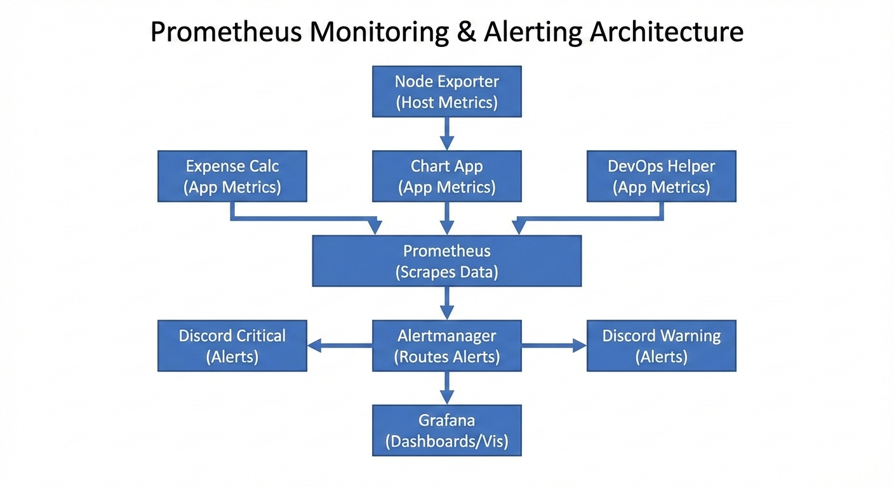

## 🎥 Demo Video

[](https://youtu.be/2geybYmuRPM?si=ZGSRgOe1NegnGBLF)

```markdown
# Monitoring Stack with Prometheus, Alertmanager, Node Exporter, and Grafana

This project sets up a complete monitoring stack using Docker Compose. It includes:
- **Prometheus** for metrics collection
- **Alertmanager** for alert routing
- **Node Exporter** for host-level metrics
- **Grafana** for visualization
- Custom alert rules and Discord integration for notifications

---

## 🛠 Services

### Prometheus
- Image: `prom/prometheus:latest`
- Config: `prometheus.yml` and `alert.rules.yml`
- Port: `9090`
- Scrapes metrics from:
  - Prometheus itself
  - Node Exporter
  - Custom apps (`devops_helper`, `expense_calculator`, `chart_app`)

### Alertmanager
- Image: `prom/alertmanager:latest`
- Config: `alertmanager.yml`
- Port: `9093`
- Routes alerts to Discord channels based on severity.

### Node Exporter
- Image: `quay.io/prometheus/node-exporter:latest`
- Port: `9100`
- Exposes host-level metrics (CPU, memory, filesystem, etc.).

### Grafana
- Image: `grafana/grafana:latest`
- Port: `3000`
- Default credentials:
  - User: `astle`
  - Password: `admin`
- Connects to Prometheus as a data source.

---

## ⚙️ Configuration

### Prometheus (`prometheus.yml`)
- Scrape interval: 5s
- Targets:
  - `localhost:9090` (Prometheus)
  - `node_exporter:9100` (Node Exporter)
  - `host.docker.internal:5000` (DevOps Helper)
  - `host.docker.internal:7000` (Expense Calculator)
  - `host.docker.internal:8000` (Chart App)
- Alerting:
  - Sends alerts to Alertmanager (`alertmanager:9093`)
- Rule files:
  - `alert.rules.yml`

### Alertmanager (`alertmanager.yml`)
- Global resolve timeout: 5m
- Routes:
  - `severity="critical"` → `discord-critical`
  - `severity="warning"` → `discord-warning`
- Receivers:
  - **discord-critical**: sends alerts to a Discord webhook for critical alerts
  - **discord-warning**: sends alerts to a Discord webhook for warning alerts
- `send_resolved: true` ensures notifications are sent when issues resolve.

### Alert Rules (`alert.rules.yml`)
- **Group: pc-Down**
  - Alerts if `expense_calculator`, `chart_app`, or `devops_helper` go down (`up == 0`).
- **Group: Alerts-For-Expense**
  - High CPU usage
  - Too many open file descriptors
  - Frequent HTTP 404 errors
- **Group: Alerts-For-Chart**
  - High CPU usage
  - Too many open file descriptors
  - Frequent HTTP 404 errors

---

## 🔗 Architecture Flow

```

```

---

## 🚀 Usage

1. Start the stack:
   ```bash
   docker-compose up -d
   ```

2. Access services:
   - Prometheus → `http://localhost:9090`
   - Alertmanager → `http://localhost:9093`
   - Grafana → `http://localhost:3000`

3. Configure Grafana:
   - Add Prometheus as a data source (`http://prometheus:9090`).
   - Import dashboards or create custom ones.

4. Test alerts:
   - Lower thresholds in `alert.rules.yml` (already reduced for testing).
   - Trigger conditions (e.g., generate 404s, increase CPU load).
   - Check Discord channels for notifications.

---

## 📌 Notes
- Keep webhook URLs out of version control — use `.env` or Docker secrets.
- Adjust thresholds in `alert.rules.yml` for production use.
- Add more groups to separate alerts by app, severity, or type.
- Use `matchers` in Alertmanager to route alerts flexibly.

---

## ✅ Example Alert Flow
1. Prometheus scrapes metrics from `expense_calculator`.
2. CPU usage exceeds threshold → `HighCPUUsage` alert fires.
3. Alertmanager routes it based on `severity: warning`.
4. Notification is sent to the **Discord warning channel**.
5. When CPU usage returns to normal, a **resolved message** is sent.
```